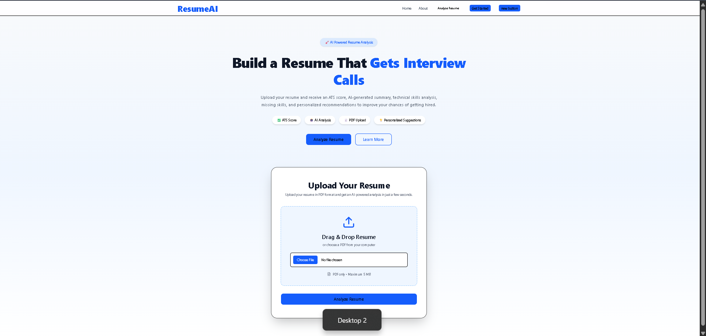
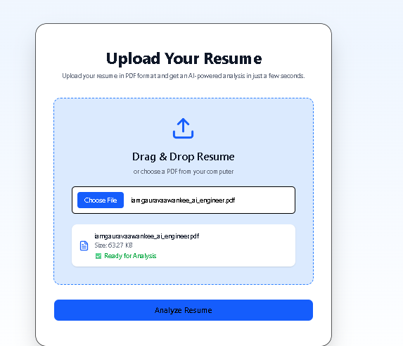
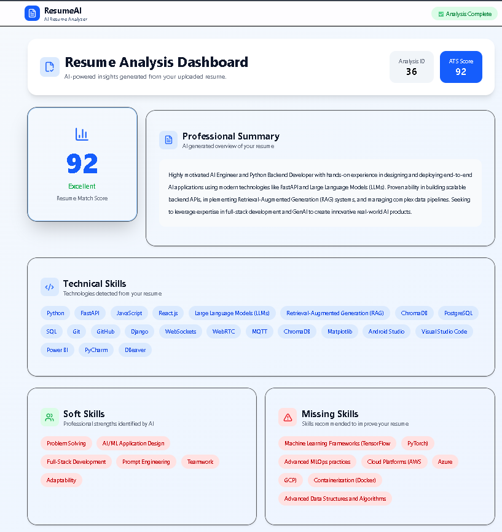
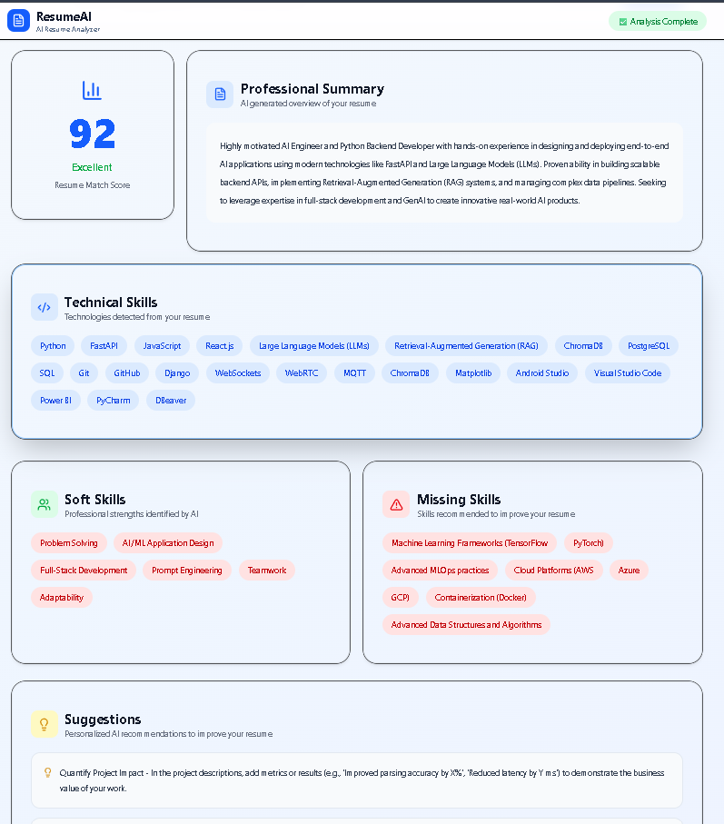
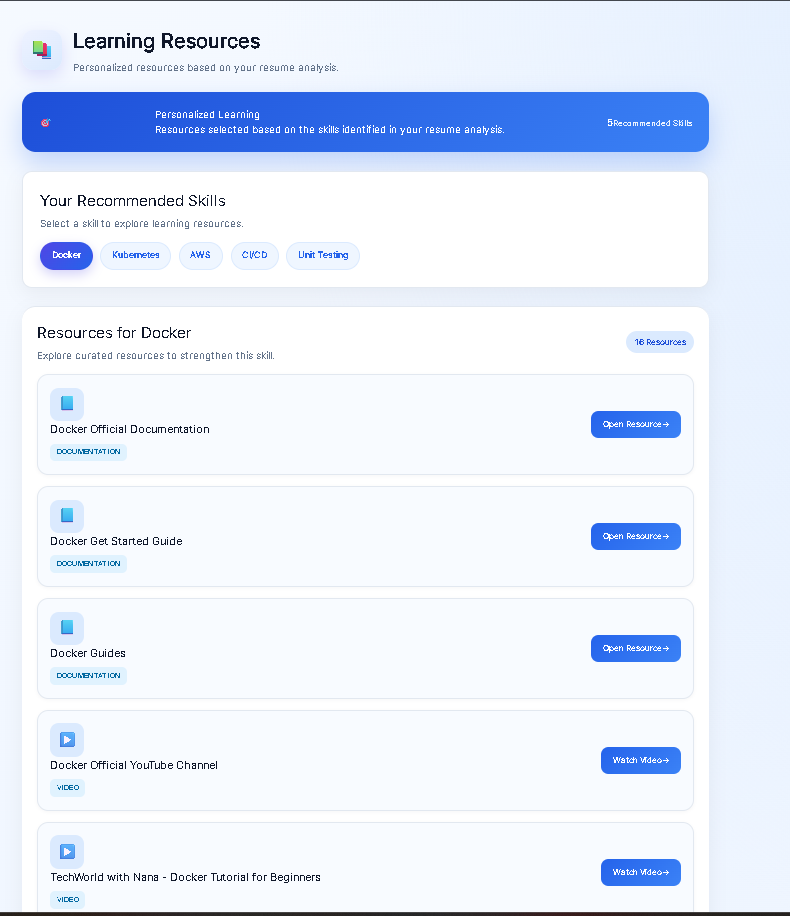
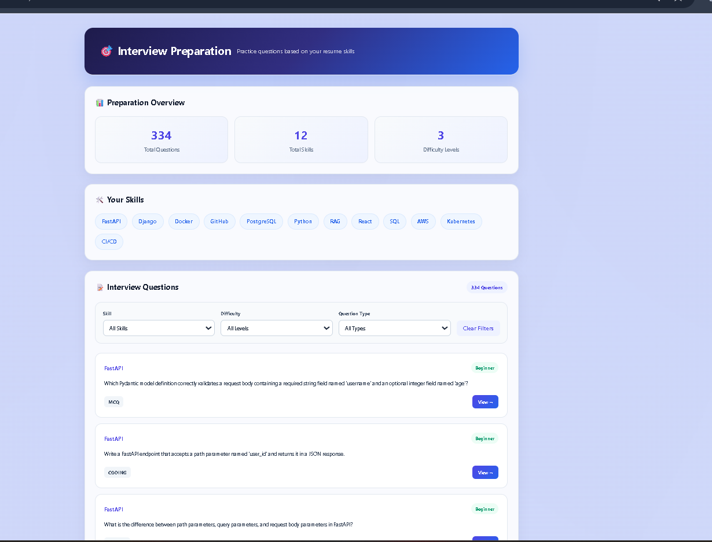
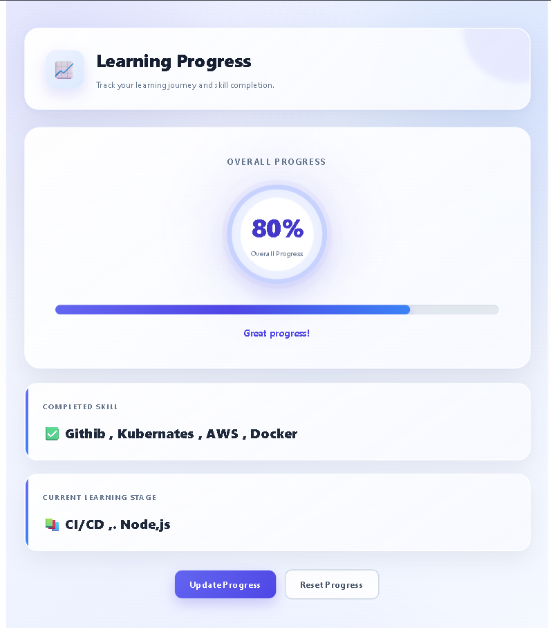
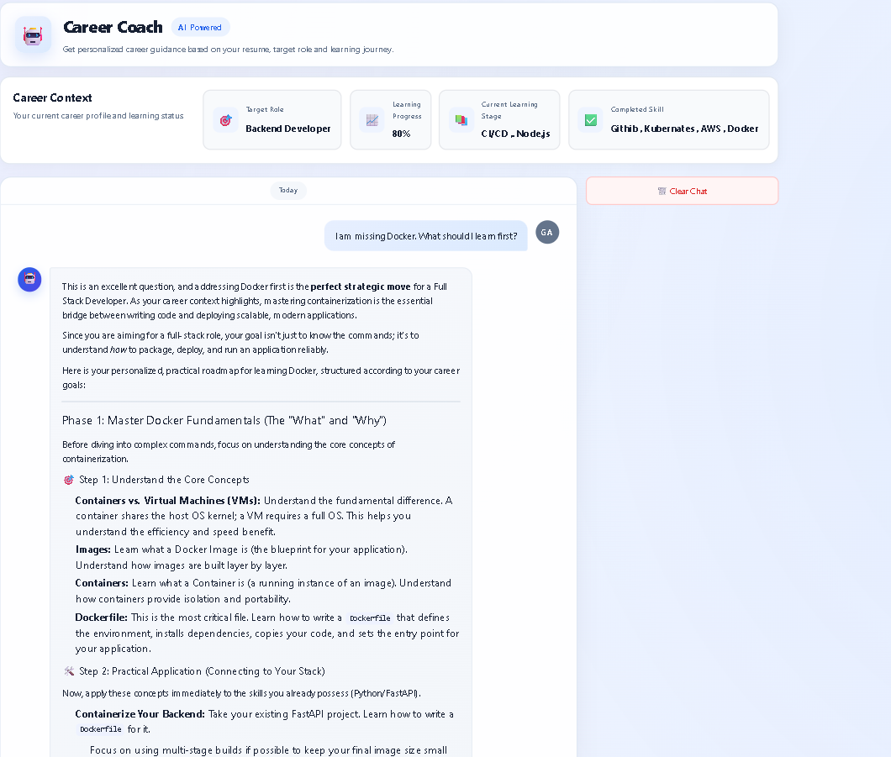

# 🤖 AI Resume Analyzer

> A full-stack AI-powered Resume Analyzer built using **React.js**, **FastAPI**, **PostgreSQL**, **ChromaDB**, and **Qwen LLM**. The application analyzes resumes against a target role and provides **ATS scoring, skill gap analysis, personalized learning roadmaps, learning resources, interview preparation, progress tracking, and an AI Career Coach**.


---

## 🚀 Key Highlights

- 📄 Upload resumes in PDF format
- 🤖 AI-powered resume analysis using Gemma & Qwen LLMs
- 📊 ATS Score with detailed evaluation
- 🛠 Technical & Soft Skills extraction
- 📉 Missing Skills identification
- 💡 Personalized improvement suggestions
- 📚 Personalized Learning Roadmap
- 🧑‍💻 Recommended Projects based on career goals
- 📖 Skill-based Learning Resources
- 🎯 Interview Preparation with skill, difficulty, and question-type filters
- 📈 Learning Progress Tracking
- 💬 AI Career Coach with personalized career guidance
- 📱 Fully responsive modern dashboard
- ⚡ FastAPI backend with PostgreSQL
- 🎨 Modern UI built with React, Tailwind CSS, and shadcn/ui
- 🧠 RAG-based knowledge retrieval using ChromaDB

---
# 📖 Project Overview

AI Resume Analyzer is a full-stack AI-powered web application that helps job seekers evaluate and improve their resumes based on their target career role using Large Language Models (LLMs).

The application allows users to upload a resume in PDF format, extract the resume content, select a target role, and receive structured AI-powered insights such as an ATS score, technical skills, soft skills, missing skills, personalized improvement suggestions, and a learning roadmap.

Beyond resume analysis, the application provides personalized learning resources, recommended projects, interview preparation, learning progress tracking, and an AI Career Coach for ongoing career guidance.

The backend is built with **FastAPI** and **PostgreSQL**, while the frontend is developed using **React**, **Tailwind CSS**, and **shadcn/ui**, providing a clean, responsive, and modern dashboard experience.

The project demonstrates the integration of **LLMs, Retrieval-Augmented Generation (RAG), ChromaDB, REST APIs, relational databases, and modern frontend development** to build a practical AI-powered career development platform.

---
# 🎯 Problem Statement

Many job seekers struggle to understand whether their resumes are optimized for Applicant Tracking Systems (ATS) and aligned with the requirements of their target roles. Traditional resume reviews are often time-consuming, subjective, or expensive.

Even after identifying resume weaknesses, job seekers often face additional challenges in understanding what skills they need to learn, which resources to use, how to prepare for interviews, and how to track their learning progress.

Common challenges include:

- Not knowing whether the resume is ATS-friendly.
- Difficulty identifying technical and soft skills present in the resume.
- Missing technical skills required for target roles.
- Difficulty identifying strengths and areas for improvement.
- Lack of personalized recommendations to improve career readiness.
- Difficulty creating a structured learning path based on skill gaps.
- Difficulty finding relevant learning resources and projects.
- Limited personalized interview preparation.
- Lack of a simple way to track learning progress.
- Limited guidance after the initial resume review.

AI Resume Analyzer addresses these challenges by analyzing resumes against target roles using Large Language Models (LLMs) and providing actionable career insights, including ATS scores, skills assessment, missing skills, personalized recommendations, learning roadmaps, learning resources, interview preparation, progress tracking, and AI-powered career guidance.
---
# 💡 Solution

AI Resume Analyzer provides an intelligent and automated solution for resume evaluation and career development by leveraging Large Language Models (LLMs), Retrieval-Augmented Generation (RAG), and modern web technologies.

The application enables users to upload a resume in PDF format, select a target career role, and receive AI-powered analysis based on the selected role. The system extracts the resume content and generates structured insights such as ATS score, technical skills, soft skills, missing skills, personalized recommendations, and career improvement suggestions.

The platform goes beyond resume analysis by helping users understand what to learn and how to prepare for their target role. It provides personalized learning roadmaps, recommended projects, skill-based learning resources, interview preparation, learning progress tracking, and an AI Career Coach for ongoing guidance.

The platform helps job seekers by providing:

- 📊 ATS Compatibility Score
- 📝 Professional Resume Summary
- 💻 Technical Skills Identification
- 🤝 Soft Skills Analysis
- ⚠️ Missing Skills Detection
- 💡 Personalized AI Recommendations
- 🗺️ Personalized Learning Roadmap
- 🧑‍💻 Recommended Projects
- 📚 Skill-based Learning Resources
- 🎯 Interview Preparation
- 📈 Learning Progress Tracking
- 💬 AI Career Coach
This automated workflow allows users to quickly understand the strengths and weaknesses of their resumes and improve them before applying for jobs.

# ✨ Features

AI Resume Analyzer provides an end-to-end AI-powered resume analysis and career development experience.

## 📄 Resume Upload

- Upload resumes in PDF format
- Drag & Drop support
- File validation
- Secure resume processing
---
# 📸 Screenshots

## 🏠 Landing Page

> Modern landing page with project introduction and resume upload section.


## 📄 Resume Upload

> Upload your resume in PDF format and start AI analysis.


## 📊 Resume Analysis Dashboard

> AI-generated ATS score, professional summary, skills analysis, and personalized recommendations.


## 📊 Resume Analysis Dashboard

> AI-generated ATS score, professional summary, skills analysis, and personalized recommendations.



## 📚 Learning Resources

> Explore skill-based learning resources recommended based on your identified skill gaps.



## 🎯 Interview Preparation

> Prepare for interviews with skill-based questions organized by difficulty and question type.



## 📈 Learning Progress

> Track your learning progress and current learning stage.



## 💬 AI Career Coach

> Get personalized career guidance and ask questions based on your resume analysis and target role.




# 🛠 Tech Stack

| Category | Technologies |
|----------|--------------|
| Frontend | React.js, Tailwind CSS, shadcn/ui, React Router, Axios |
| Backend | FastAPI, SQLAlchemy |
| Database | PostgreSQL |
| AI / LLM | Google Gemma, Qwen 2.5, LM Studio |
| Tools | Git, GitHub, VS Code, Postman |

# 🏗 System Architecture

User
  │
  ▼
React Frontend
  │
  ▼
Axios API
  │
  ▼
FastAPI Backend
  │
  ├── Resume Processing
  │       │
  │       ▼
  │   PDF Text Extraction
  │
  ├── Role Selection
  │
  ├── RAG Pipeline
  │       │
  │       ├── Embeddings
  │       └── ChromaDB
  │
  ▼
Gemma / Qwen LLM
  │
  ▼
Structured AI Analysis
  │
  ▼
PostgreSQL
  │
  ▼
React Dashboard
  │
  ├── Resume Analysis
  ├── Learning Roadmap
  ├── Resources
  ├── Interview Preparation
  ├── Progress Tracking
  └── AI Career Coach
---

# 🔄 Application Workflow

The following workflow illustrates how the AI Resume Analyzer processes a resume from upload to AI-generated insights.

```text                   User
                     │
                     ▼
            Upload Resume (PDF)
                     │
                     ▼
            Select Target Role
                     │
                     ▼
           Validate Resume File
                     │
                     ▼
          Extract Resume Text
                 (PyPDF)
                     │
                     ▼
          Retrieve Knowledge
                (ChromaDB)
                     │
                     ▼
        Send Context + Resume
              to LLM
          (Gemma / Qwen)
                     │
                     ▼
      Generate Structured JSON
                     │
                     ▼
     Store Analysis in PostgreSQL
                     │
                     ▼
        Return analysis_id
                     │
                     ▼
 Navigate to /results/{analysis_id}
                     │
                     ▼
      Fetch Analysis via FastAPI
                     │
                     ▼
        Display Results Dashboard
```

### Workflow Summary

### Workflow Summary

1. User uploads a resume in PDF format.
2. The backend validates and processes the uploaded file.
3. Resume text is extracted using **PyPDF**.
4. The user selects a target career role.
5. Relevant knowledge is retrieved from **ChromaDB** using embeddings.
6. Resume content, target role, and retrieved context are sent to the **Gemma/Qwen LLM**.
7. The AI generates structured JSON containing ATS score, skills, missing skills, suggestions, and career insights.
8. The analysis is stored in **PostgreSQL**.
9. The backend returns an `analysis_id`.
10. React fetches the analysis and displays the results dashboard.

# 📂 Folder Structure
resume-analyzer/
│
├── frontend/
├── backend/
├── screenshots/
└── README.md

🚀 Installation
```bash
git clone https://github.com/your-username/ai-resume-analyzer.git
cd ai-resume-analyzer
```

## Frontend

```bash
cd frontend
npm install
npm run dev
```

## Backend

```bash
cd backend
pip install -r requirements.txt
uvicorn main:app --reload
```
# ⚙ Environment Variables

Create a `.env` file in the backend directory.

```env
DATABASE_URL=your_postgresql_connection
LM_STUDIO_BASE_URL=http://localhost:1234/v1
MODEL_NAME=gemma-or-qwen
UPLOAD_FOLDER=upload/
```
# 📡 API Endpoints

### Resume

- `POST /upload`
- `GET /analysis/{analysis_id}`

### Roles

- `GET /roles`
- `GET /roles/{role_id}`

### Learning Roadmap

- `GET /learning-roadmap/{resume_id}`

### Learning Resources

- `GET /learning-resources/{resume_id}`

### Interview Preparation

- `GET /interview-preparation/{resume_id}`

### Progress Tracking

- `GET /progress_tracking/{resume_id}`
- `PUT /progress_tracking/{resume_id}`
- `POST /progress-tracking/{resume_id}/reset`

### Career Coach

- `POST /career-chat`
- `GET /career-chat/history/{resume_id}`
- `DELETE /career-chat/history/{resume_id}`
# 👨‍💻 Author

**Gaurav Aawanke**

AI Backend & GenAI Engineer

- GitHub: https://github.com/iamgauravaawanke
- LinkedIn: https://www.linkedin.com/in/iamgauravaawanke/


